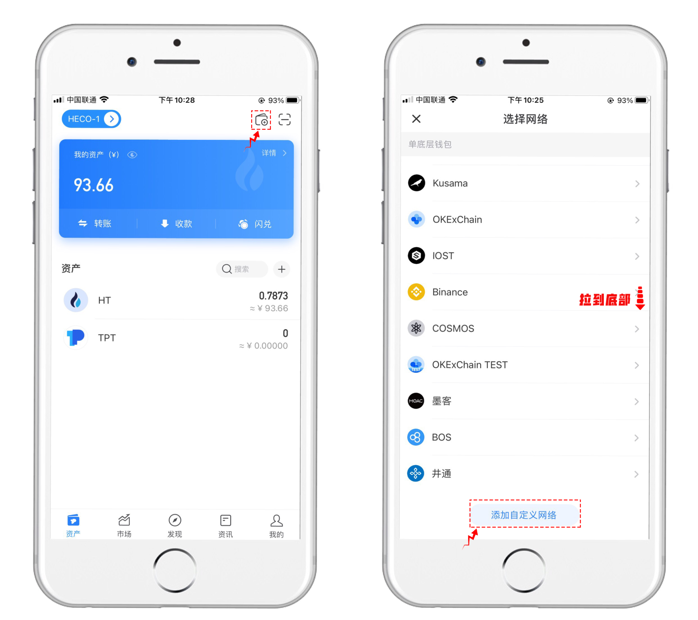
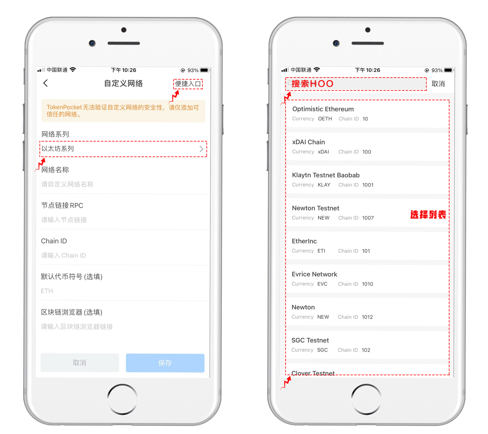
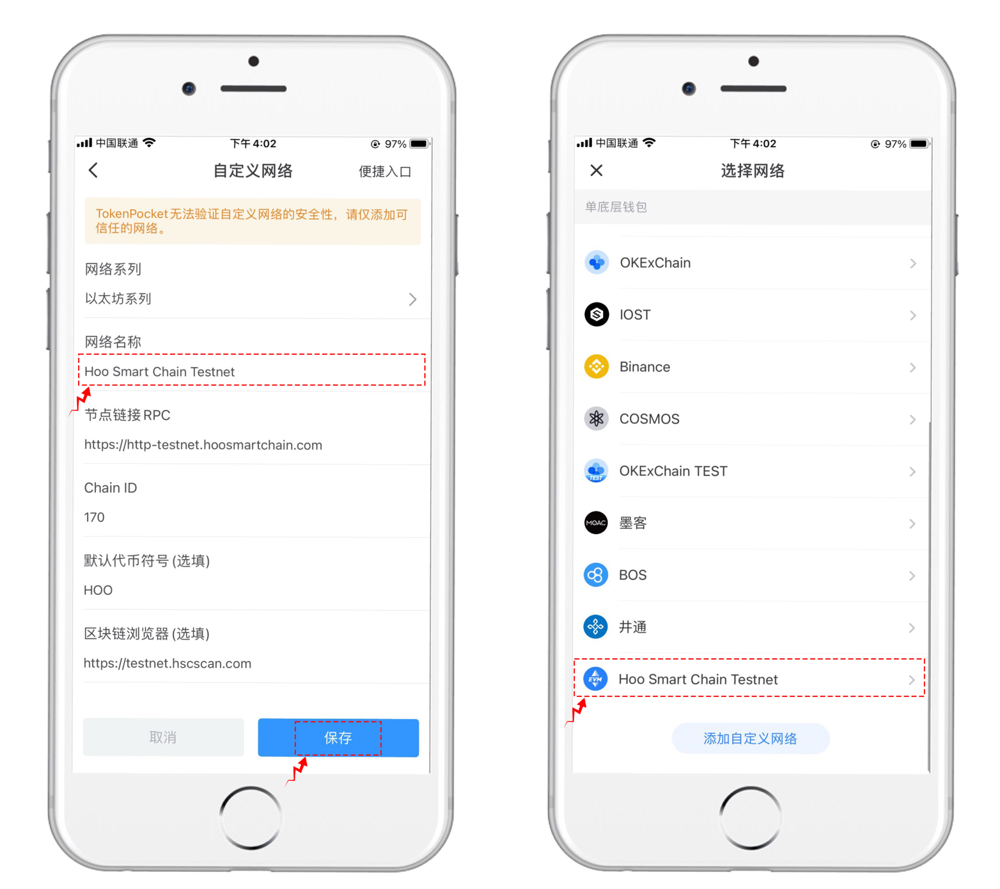
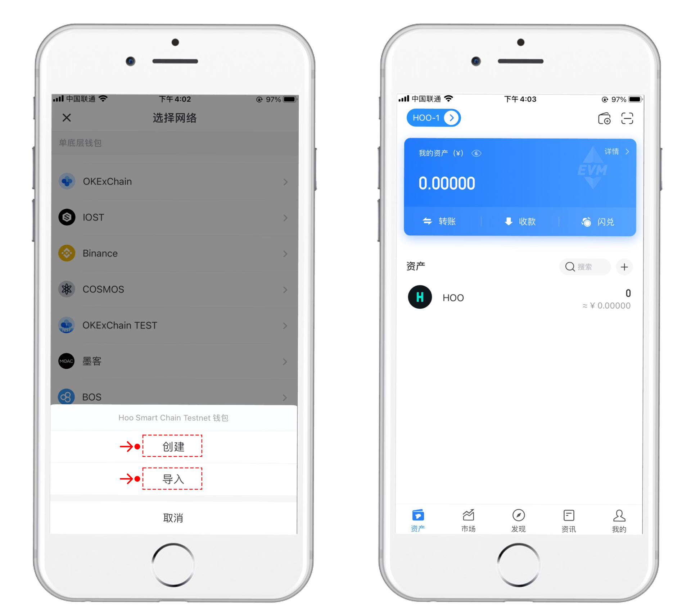

# 如何使用 TokenPocket 钱包参与虎符智能链的测试网

虎符、TokenPocket 达成合作，开启虎符智能链测试网。TokenPocket 作为全球最大的去中心化多链钱包，为此次虎符智能链的测试提供充分的流量支持与资源支持。

## 关于虎符智能链（HSC）
    虎符智能链（Hoo Smart Chain，简称 HSC）是一条去中心化、高效节能的公链。可为开发人员提供高效且低成本的链上环境，以运行去中心化智能合约应用程序 (DApps) 和存储数字资产。

<!-- ## 测试网
    名称：HSC TESTNET(HSC 测试网)
    节点链接 RPC：https://http-testnet.hoosmartchain.com
    Chain ID：170
    默认代币符号（选填）：HOO
    区块链浏览器（选填）：https://testnet.hscscan.com -->

## 加入虎符智能链测试网流程

### 1. 下载 TokenPocket 钱包
    下载传送门：www.tokenpocket.pro

    PS：请务必更新 TP 钱包到最新版本，方可体验自定义网络功能

### 2. 操作
##### I、打开钱包，点击右上角第一个图标【添加钱包】，列表拉到底部可以看到【添加自定义网络】入口，单击进入
 

##### II、自定义网络可以自己设置所需参数，也可以点击右上角的【便捷入口】来快速选择所需网络，只需要顶部搜索 HOO，即可查看到信息
 

##### III、导入虎符智能链测试网信息后，点击保存即可。保存后在列表最后一位即可看到虎符智能链测试网的网络入口。
 

##### IV、点击新添加的虎符智能链测试，可选【创建】或【导入】，即可完成自定义网络的快速添加和使用。
 