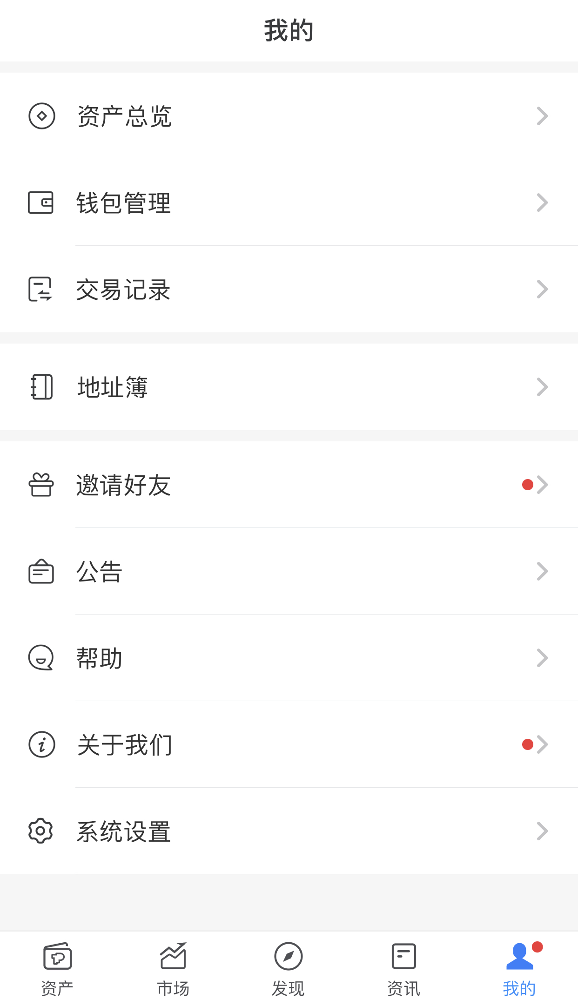
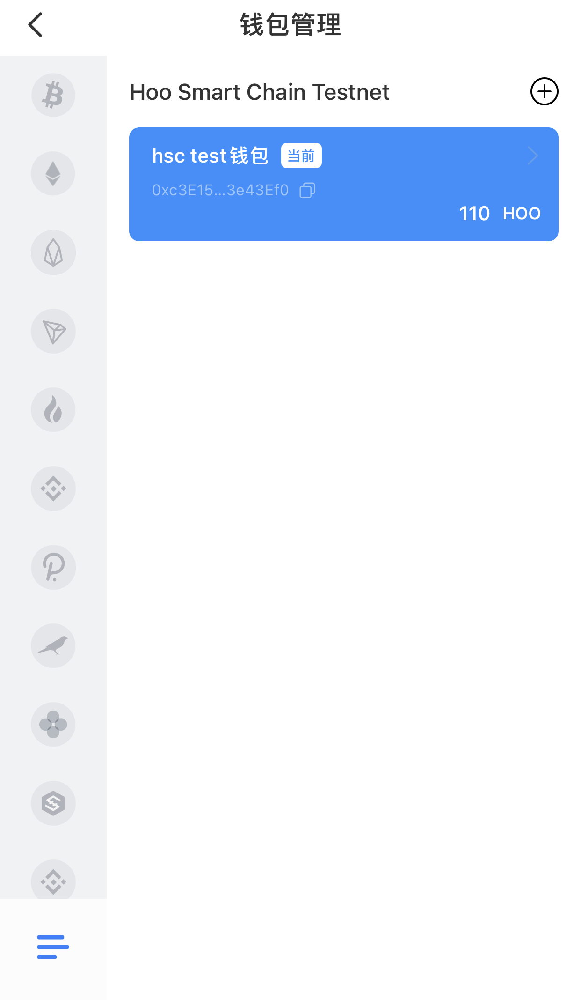
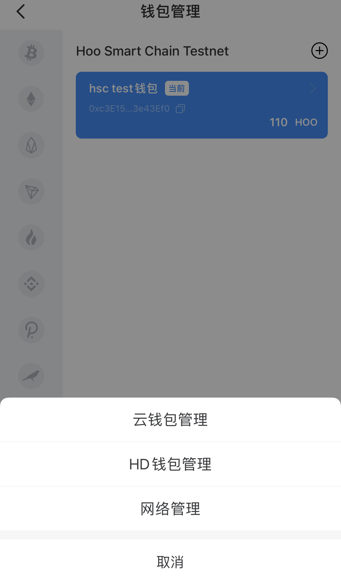
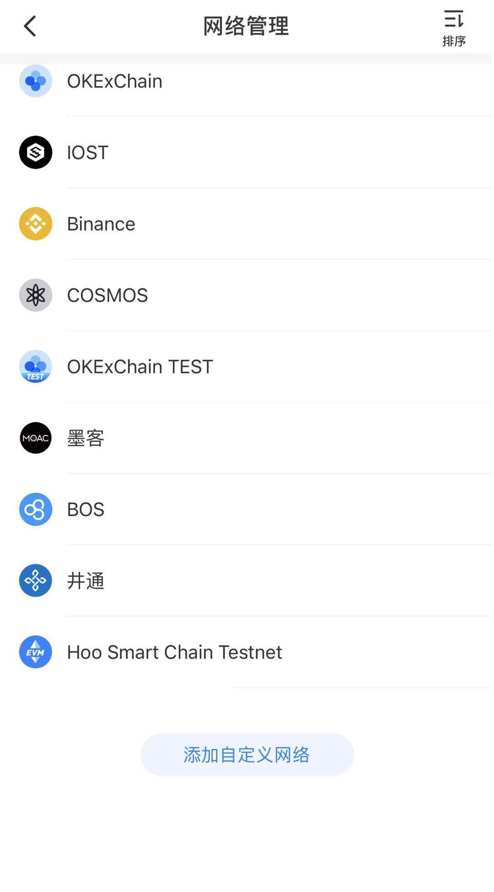
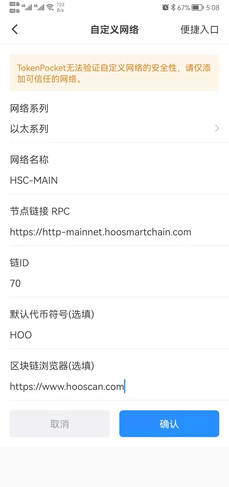
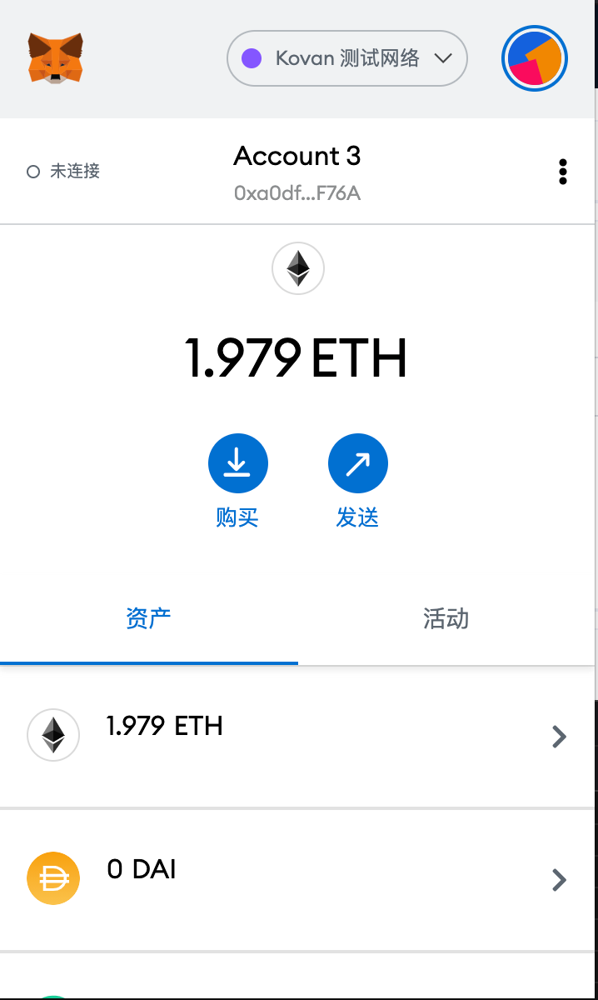
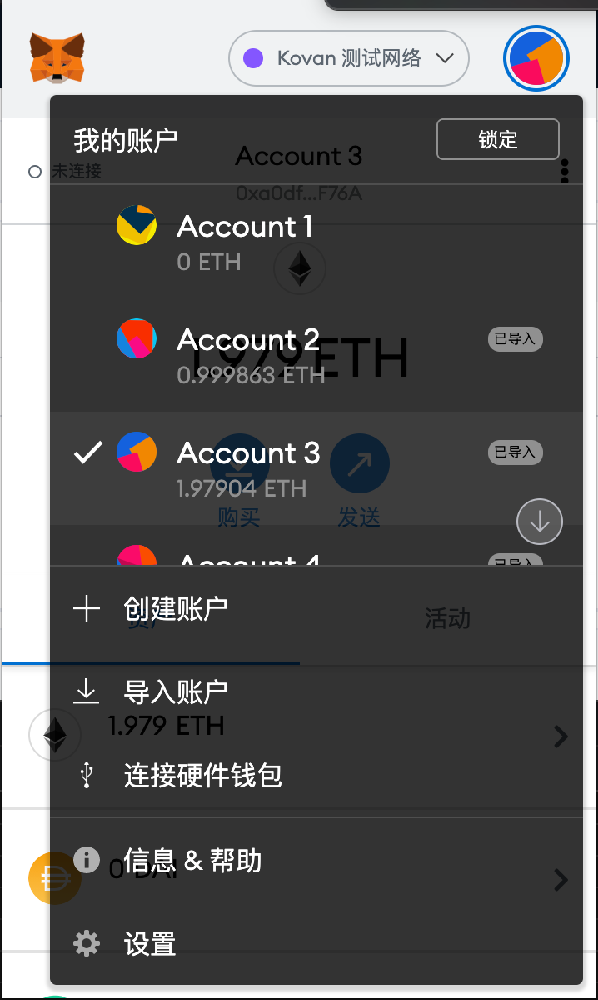
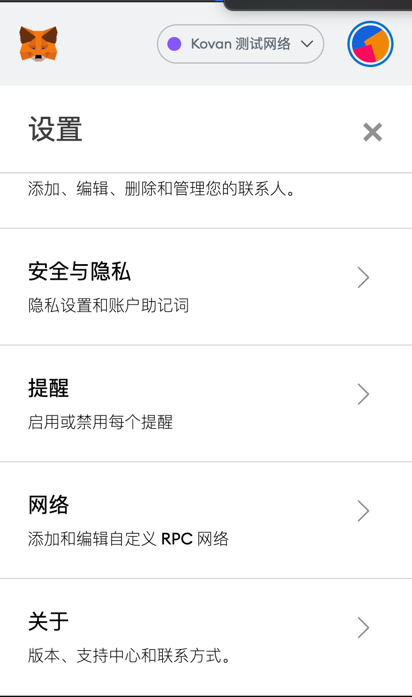
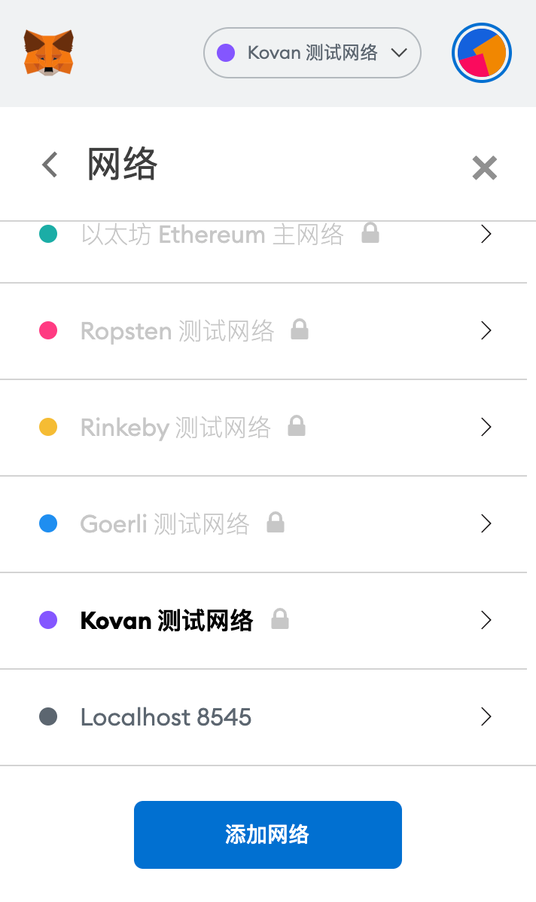
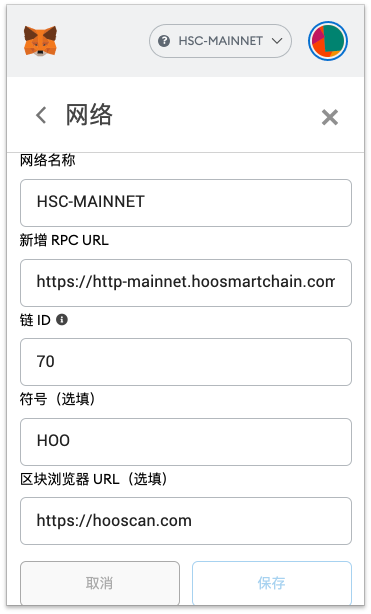

# 介绍

Hoo Smart Chain（HSC) 支持TokenPocket、MetaMask等主流钱包，包括手机端APP及浏览器插件。

## 添加HSC网络到TokenPocket(v1.2.4)流程
下载TokenPocket: https://www.tokenpocket.pro/zh/download/app

#### 1. 打开TokenPocket，点击右下角‘我的’
<br>

#### 2. 在‘我的’界面，点击‘管理钱包’
<br> 

#### 3. 在‘管理钱包’界面，点击左下角按钮
<br> 

#### 4. 点击‘网络管理’
<br> 

#### 5. 在‘网络管理’页面，往下拉，点击‘自定义网络’
<br> 

#### 6. 输入相关信息点击保存
<br> 


## 添加HSC网络到MetaMask流程

下载地址：https://metamask.io/
#### 1. 打开MetaMask，点击右上角圆形图标
<br>

#### 2. 点击设置
<br>

#### 3. 点击网络
<br>

#### 4. 点击添加网络
<br>

#### 5. 输入信息，点击保存
<br>


## 主网参数

```
chainid: 70
rpc: https://http-mainnet.hoosmartchain.com
scan: https://hooscan.com
```
<!-- 
## 测试网

```
chainid: 170
rpc: https://http-testnet.hoosmartchain.com
scan: https://testnet.hscscan.com
``` -->